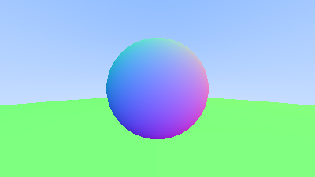
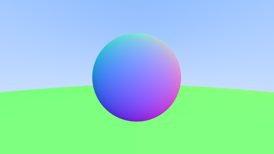
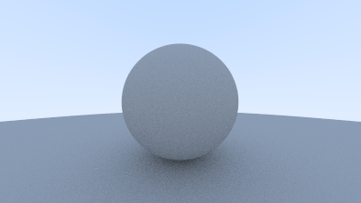
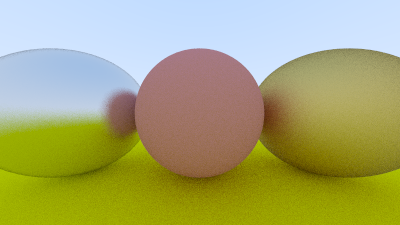

# Intro to Ray Tracing and Rust

Followed the guide from https://the-ray-tracing-road-to-rust.vercel.app/

## Gallery 

### Hello graphics!

Commit: 95561b9

### Linear interpolation

Commit: 985a97e

### Add sphere

Commit: 2ad9843

### Add surface normals and multiple objects

Commit: b41cdc8

### Antialiasing

Commit: 0840164

### Diffusion

Commit: 8ae1386

### Metals

Commit: ae5f712

